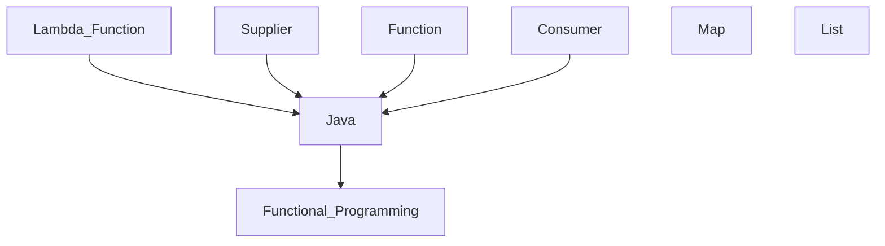

Abstract
--- 
Functional programming make codes more easy to read for processing of data. This article will containing some example for quickly getting brief understanding of functional programming. Example will focus on general usage about map, and list. Let's take a look some



Lambda Function
---
It providing a functionality for programmer to write a function as a variable rather than create an instance and apply methods in it.

```java
class Example {
    
    public static twoTimes = (x) -> x * 2;
    public static predicate = (x) -> x.hasValidated();
    public static bifunctionExample = (x, y) -> x.doSomethingWith(y);
}
```

Streaming process
---
Like the pipeline on terminal(like bash, zsh, etc). In stream there is 3 staff. Supplier, Function, and Consumer. 
- Supplier is start of the stream. Job of it is return the data for start the stream.
- Function is middles of the stream. Job of it is catch previous returned value, process it, then pass something to the downstream.
- Consumer is end of the stream. Job of it is do some thing with previous value then close the stream.

```
Supplier --Object--> Function --Object--> ...Functions... --Object--> Consumer
```
